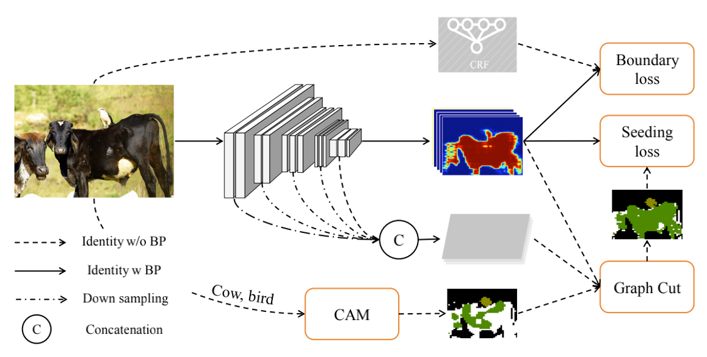
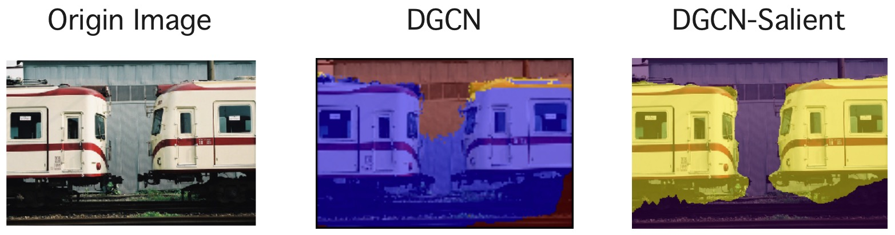
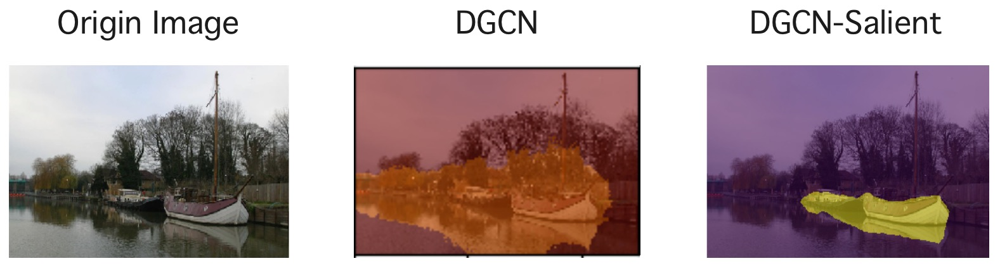
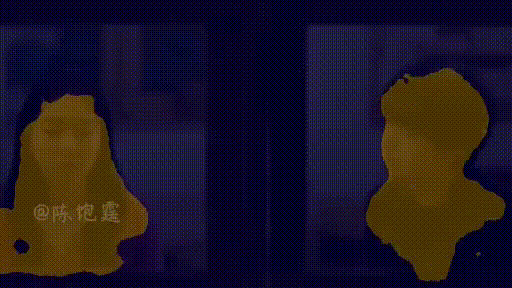

<div align="center">   
  
# Deep Graph 🔪 Network
</div>

**TL;DR:**  We study the **Graph Cut** algorithm on deep neural network with **Weakly Supervised Semantic Segmentation** 
task, and achieved SOTA performence at that time.

:man_technologist: This project is under active development :woman_technologist: :


* **`Jun 29, 2021`:**  We release [this](https://github.com/Unrealluver/dgcn) repo that contains more results, check it out!

* **`Jan 26, 2021`:**  We firstly release our [DGCN](https://github.com/hustvl/DGCN) repo, check it out!

#

> [**Deep Graph Cut Network for Weakly-supervised Semantic Segmentation**](http://xinggangw.info/pubs/scis-dgcn.pdf)
>
> by Jiapei Feng \*, [Xinggang Wang](https://xinggangw.info/)<sup>* </sup>,  [Wenyu Liu](http://eic.hust.edu.cn/professor/liuwenyu/).
> 
> <sup>1</sup> [School of EIC, HUST](http://eic.hust.edu.cn/English/Home.htm), <sup>2</sup> Institute of AI, HUST, <sup>3</sup> [Horizon Robotics](https://en.horizon.ai).
> 
> (<sup>* </sup>) corresponding author.
> 
> *Science China Information Sciences volume  ([Published: 07 February 2021](https://link.springer.com/article/10.1007/s11432-020-3065-4))*

<br>

## Deep Graph Cut Network for Weakly-supervised Semantic Segmentation (DGCN)

### The Illustration of DGCN


### Highlights

The main contributions of this paper can be summarized as follows: 

* We propose a **graph cut** neural network, which enables the network accurately generates new pixel-level labels for weakly-supervised semantic segmentation.

* The deep **graph cut** network obtains strong weakly-supervised semantic segmentation performance on the `PASCAL VOC` and `COCO` segmentation benchmarks, which demonstrates the effectiveness of the proposed **deep graph cut module** for generating supervisions.

* We build the connections between **weakly-supervised** semantic segmentation and **semi-supervised** learning. Besides of the instantiation of the deep graph cut algorithm, more semi-supervised learning methods can be applied to solve this problem.

### Results
**TL;DR:**  The results trained for PASCAL VOC 2012 with proper training params could achieve the **miou 0.634** on Pascal VOC 2012 `Eval Set`. After retrain step, it will get a higher result.

| Backbone  | Resize<br>Long | Crop | Resize<br>Cropped | Color<br>Jitter | Random<br>Aug | Cutout | Pad0 | Batchsize | LR       | Decay | Freeze-1 | Freeze01 | 10xLr<br>LastStage | SyncBn | GPUNum | Optim | mIOU   |
| :---------: | :----------: | :----: | :-------------: | :-----------: | :---------: | :------: | :----: | :---------: | :--------: | :-----: | :--------: | :--------: | :---------------: | :------: | :------: | :-----: | :------: |
| ResNet101 | ❌        | 321  | ❌           | ❌         | ❌       | ❌    | ❌  | 16        | 5.00E-04 | 3     | ❌      | ❌      | ✅             | ❌    | 1      | Step  | 0.615  |
| HRNetw48  | ❌        | 321  | ❌           | ❌         | ❌       | ❌    | ❌  | 16        | 5.00E-04 | 3     | ❌      | ❌      | ❌             | ❌    | 1      | Step  | 0.6239 |
| HRNetw48  | ❌        | 422  | 321           | ❌         | ❌       | ❌    | ❌  | 16        | 5.00E-04 | 3     | ❌      | ❌      | ❌             | ❌    | 1      | Step  | 0.6296 |
| HRNetw48  | [320, 640] | 512  | ❌           | ❌         | ❌       | ❌    | ❌  | 8         | 5.00E-04 | 3     | ❌      | ❌      | ❌             | ❌    | 2      | Step  | 0.6173 |
| HRNetw48  | [320, 640] | 512  | ❌           | ✅         | ❌       | ❌    | ❌  | 8         | 5.00E-04 | 3     | ❌      | ❌      | ❌             | ❌    | 2      | Step  | 0.6312 |
| HRNetw48  | [320, 640] | 512  | ❌           | ✅         | ❌       | ❌    | ❌  | 12        | 5.00E-04 | 3     | ❌      | ❌      | ❌             | ❌    | 2      | Step  | 0.6257 |
| HRNetw48  | [320, 640] | 512  | ❌           | ✅         | ❌       | ❌    | ❌  | 24        | 5.00E-04 | 3     | ❌      | ❌      | ✅             | ✅    | 4      | Step  | 0.6328 |
| HRNetw48  | [320, 640] | 512  | ❌           | ✅         | ✅       | ✅    | ❌  | 24        | 5.00E-04 | 3     | ❌      | ❌      | ✅             | ✅    | 4      | Step  | 0.6241 |
| HRNetw48  | [320, 640] | 512  | ❌           | ✅         | ✅       | ✅    | ❌  | 6         | 5.00E-04 | 3     | ❌      | ❌      | ✅             | ❌    | 1      | Step  | 0.6164 |
| HRNetw48  | [320, 640] | 512  | ❌           | ✅         | ❌       | ✅    | ❌  | 12        | 5.00E-04 | 6     | ❌      | ❌      | ✅             | ✅    | 2      | Step  | 0.6183 |
| HRNetw48  | [320, 640] | 512  | ❌           | ✅         | ❌       | ✅    | ❌  | 12        | 1.00E-03 | 3     | ❌      | ❌      | ✅             | ✅    | 2      | Step  | 0.6121 |
| HRNetw48  | [320, 640] | 512  | ❌           | ✅         | ❌       | ✅    | ❌  | 12        | 7.50E-04 | 3     | ❌      | ❌      | ✅             | ✅    | 2      | Step  | 0.6204 |
| HRNetw48  | [320, 640] | 512  | ❌           | ✅         | ❌       | ❌    | ❌  | 12        | 2.50E-04 | 3     | ❌      | ❌      | ✅             | ✅    | 2      | Step  | 0.6343 |
| HRNetw48  | [320, 640] | 512  | ❌           | ✅         | ❌       | ❌    | ❌  | 12        | 2.50E-04 | 3     | ❌      | ✅      | ✅             | ✅    | 2      | Step  | 0.6315 |
| HRNetw48  | [320, 640] | 512  | ❌           | ✅         | ✅       | ❌    | ❌  | 12        | 2.50E-04 | 3     | ❌      | ✅      | ✅             | ✅    | 2      | Poly  | 0.6321 |
| HRNetw48  | [320, 640] | 512  | ❌           | ✅         | ❌       | ❌    | ✅  | 12        | 2.50E-04 | 3     | ❌      | ✅      | ✅             | ✅    | 2      | Step  | 0.6327 |
| HRNetw48  | [320, 640] | 512  | ❌           | ✅         | ❌       | ❌    | ✅  | 12        | 2.50E-04 | 3     | ❌      | ✅      | ✅             | ✅    | 2      | Poly  | 0.6348 |
| HRNetw48  | [320, 640] | 512  | ❌           | ✅         | ❌       | ❌    | ❌  | 12        | 2.50E-04 | 3     | ✅      | ❌      | ✅             | ✅    | 2      | Step  | 0.6312 |
| HRNetw48  | [320, 640] | 512  | ❌           | ✅         | ❌       | ❌    | ❌  | 12        | 2.50E-04 | 3     | ✅      | ❌      | ✅             | ✅    | 2      | Poly  | 0.6296 |

**Additional**: 

- Different from the implement in the origin paper, we would like to discover more posibility, so we list the **DGCN** methods trained with both `PASCAL VOC 2012` and `DUTS` salient dataset and call it `Salient-Guide-DGCN`

| Backbone | TrainDataset | ResizeLong | BatchSize | Crop | ColorJitter | LR       | Optim | mIOU   |
| :--------: | :------------: | :----------: | :---------: | :----: | :-----------: | :--------: | :-----: | :------: |
| HRNetw48 | Pascal+DUTS  | [320, 640] | 3         | 512  | ✅         | 1.50E-04 | Step  | 0.6637 |

- And we do the retrain proces on the `PASCAL VOC 2012` & `DUTS` both trained result.

| Model     | mIOU   |
| :---------: | :------: |
| DeepLabV2 | 0.6747 |
| DeepLabV3 | 0.6931 |

- Here is the **Result Comparation**:

| Method                         | TrainDataset | Result on Eval | Result on Test |
| :------------------------------: | :------------: | :--------------: | :--------------: |
| FCN                            | 9K           | -              | 62.20%         |
| DeepLab                        | 10K          | 67.60%         | 70.30%         |
| BoxSup                         | 10k          | 62.00%         | 64.60%         |
| ScribbleSup                    | 10K          | 63.10%         | -              |
| SEC                            | 10K          | 50.70%         | 51.10%         |
| DSRG                           | 10K          | 61.40%         | 63.20%         |
| DGCN                           | 10K          | 60.80%         | -              |
| DGCN-retrain                   | 10K          | 64.00%         | 64.60%         |
| RRM                            | 10K          | 66.30%         | 66.60%         |
| LIID                           | 10K          | 66.50%         | 67.50%         |
| <i>LIID<sup>†<sup>             | 10K          | 69.40%         | 70.40%         |
| DRS                            | 10K          | 62.90%         | -              |
| PuzzleCAM                      | 10K          | 64.70%         | -              |
| <i>PuzzleCAM<sup>†<sup>        | 10K          | 74.10%         | 74.60%         |
| <b>Ours:                          |              |                |                |
| <b>DGCN[hrnet]                    | 10K+DUTS     | 66.40%         | -              |
| <b>DGCN[hrnet]-<br>retrain[DeeplabV2] | 10K          | 67.50%         | -              |
| <b>DGCN[hrnet]-<br>retrain[DeeplabV3] | 10K          | 69.31%         | -              |

### Requirement
This codebase has been developed with python version 3.7.6, PyTorch 1.2+ and torchvision 0.4+:
```setup
conda install -c pytorch pytorch torchvision
```
Install py-maxflow (for graphcut algorithm running) and pydensecrf (also for training process and eval):
```setup
pip install PyMaxflow
pip install git+https://github.com/lucasb-eyer/pydensecrf.git
```

### Data preparation
Download and PASCAL VOC 2012 dataset and DUTS dataset. 

* [Download PASCAL VOC 2012](http://host.robots.ox.ac.uk/pascal/VOC/voc2012/#devkit)
  
* you can obtain `SegmentationClassAug/` [[link]](https://drive.google.com/drive/folders/1_ik8n5Q4C77X-aIfKiqidFEDQ6zY9JNM?usp=sharing) (augmented with SBD dataset).

* Download [DUTS TRAIN](http://saliencydetection.net/duts/download/DUTS-TR.zip) and [DUTS_TEST](http://saliencydetection.net/duts/download/DUTS-TE.zip)


You could refer the directory structure to be the following:

~~~
# dataset structure
VOC2012/
    --- Annotations/
    --- ImageSets/
    --- JPEGImages/
    --- SegmentationClassAug/
DUTS/
    --- DUTS-TE
        --- DUTS-TE-Image
        --- DUTS-TE-Mask
    --- DUTS-TR
        --- DUTS-TR-Image
        --- DUTS-TR-Mask
 ~~~


* Download the **cues** of VOC2012 in [BaiduNetDisk](https://pan.baidu.com/s/1hlY26Ci9GZsVGrYVGTFELg), its password is `whrw`. We suggest you put it in the `datainfo` folder.

* If you want to use `HRNet` as the backbone, you would better download its pretrained model in [BaiduNetDisk](https://pan.baidu.com/s/1-loIVA5cYWm6k2UyhWcCPw), its password is `2fbm`. We suggest you put it in the `pretrained` folder.


### Training


<details>
<summary>To train the <code>dgcn-orign</code> model in the paper with <b>single-gpus</b>, run this command:</summary>
<pre><code>

python3.7 run_sample.py \
    --voc12_data_dir /data/zhulianghui/data/VOC2012/VOCdevkit/VOC2012/ \
    --model models.seg_resnet101 \
    --batch_size=8 \
    --train_dgcn_pass=True \
    --make_pred_pass=False \
    --eval_pred_pass=False \
    --name=dgcn \
    --random_seed=504 

</code></pre>

</details>


<details>
<summary>To train the <code>dgcn-orign</code> model in the paper with <b>multi-gpus</b>, run this command:</summary>
<pre><code>

python3.7  -m torch.distributed.launch \
    --nproc_per_node=2 \
    run_sample.py \
    --voc12_data_dir /data/zhulianghui/data/VOC2012/VOCdevkit/VOC2012/ \
    --model models.seg_resnet101 \
    --batch_size=8 \
    --train_dgcn_pass=True \
    --make_pred_pass=False \
    --eval_pred_pass=False \
    --name=dgcn \
    --random_seed=504 

</code></pre>

</details>


<details>
<summary>To train the <code>dgcn-hrnet</code> model in the paper, run this command:</summary>
<pre><code>

python3.7  -m torch.distributed.launch \
    --nproc_per_node=2 \
    run_sample.py \
    --voc12_data_dir /data/zhulianghui/data/VOC2012/VOCdevkit/VOC2012/ \
    --model models.seg_hrnet \
    --batch_size=8 \
    --train_dgcn_pass=True \
    --make_pred_pass=False \
    --eval_pred_pass=False \
    --name=dgcn \
    --random_seed=504 

</code></pre>

</details>

### Make Prediction

To make the prediction of the trained model, run:

```make_pred
python3.7 run_sample.py --voc12_data_dir /data/zhulianghui/data/VOC2012/VOCdevkit/VOC2012/ --train_dgcn_pass=False --make_pred_pass=True --eval_pred_pass=False --name=dgcn --random_seed=504 
```

If you got the error hint:`RuntimeError: unable to open shared memory object </torch_34514_2312401400> in read-write mode`, you may try to set this in terminal before evaluation.
```
ulimit -SHn 51200
```

### Evaluation

To evaluate prediction on last step, run:

```eval
python3.7 run_sample.py --voc12_data_dir /data/zhulianghui/data/VOC2012/VOCdevkit/VOC2012/ --train_dgcn_pass=False --make_pred_pass=False --eval_pred_pass=True --name=dgcn --random_seed=504 
```


### Visualization

* **Visualize the comparation of different stages of dgcn:**



- We could also say `Railroad is not a Train`.



* **Some GIF result presentation:**




## Acknowledgement :heart:
This project is based on [DGCN_OFFICIAL](https://github.com/hustvl/DGCN) and DSRG ([paper](https://openaccess.thecvf.com/content_cvpr_2018/papers/Huang_Weakly-Supervised_Semantic_Segmentation_CVPR_2018_paper.pdf), [code](https://github.com/speedinghzl/DSRG)). Thanks for their wonderful works.


## Citation

If you find our paper and code useful in your research, please consider giving a star :star: and citation :pencil: :

```BibTeX
@article{article,
  author = {Feng, Jiapei and Wang, Xinggang and Liu, Wenyu},
  year = {2021},
  month = {03},
  pages = {},
  title = {Deep graph cut network for weakly-supervised semantic segmentation},
  volume = {64},
  journal = {Science China Information Sciences},
  doi = {10.1007/s11432-020-3065-4}
}
```
